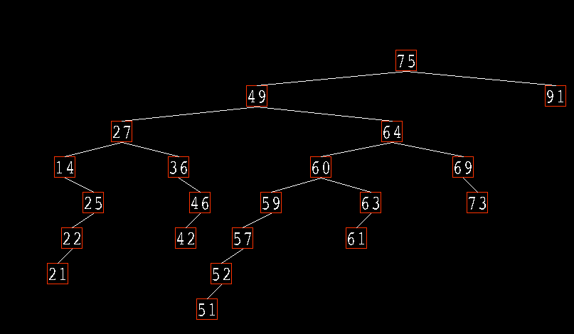

This project was undertaken to learn: 

1. Binary Tree Traversal
2. C++
3. SDL2 Library

At this stage I am leaving the project as is. 

It will generate 20 random nodes on launch and display them using SDL.
In future I would like to add user input functionality but I am shifting focus to other work.

The Project makes use of SDL2 and SDL2_TTF.
